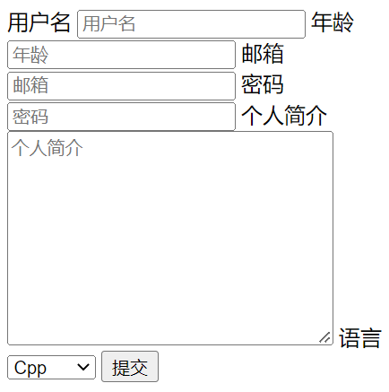
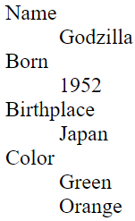
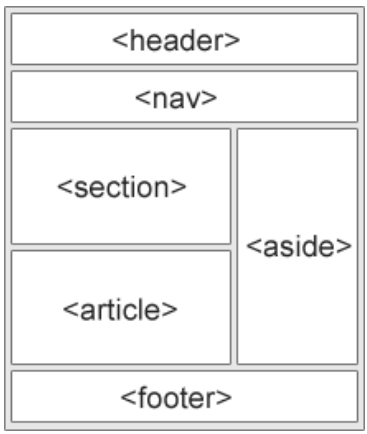

# html基础
<!-- TOC -->

- [1. html文件夹结构](#1-html文件夹结构)
- [2. 多行注释](#2-多行注释)
- [3. 文本标签](#3-文本标签)
  - [3.1. `<div>`块元素](#31-div块元素)
  - [3.2. `<span>`行内元素](#32-span行内元素)
  - [3.3. `<h1-h6>`](#33-h1-h6)
  - [3.4. `<p>`段](#34-p段)
  - [3.5. `<pre>`预定义格式文本](#35-pre预定义格式文本)
  - [3.6. `<br>` 换行](#36-br-换行)
  - [3.7. `<hr>`水平线](#37-hr水平线)
  - [3.8. `<i>`斜体](#38-i斜体)
  - [3.9. `<b>`加粗](#39-b加粗)
  - [3.10. `<strong>`加粗](#310-strong加粗)
  - [3.11. `<del>`删除线](#311-del删除线)
  - [3.12. `<ins>`下划线](#312-ins下划线)
  - [3.13. `<mark>`高亮](#313-mark高亮)
- [4. ``图片](#4-img图片)
  - [4.1. `src`路径](#41-src路径)
  - [4.2. `alt`属性](#42-alt属性)
  - [4.3. `height`](#43-height)
  - [4.4. `width`](#44-width)
- [5. `<audio>`音频和`<video>`视频](#5-audio音频和video视频)
  - [5.1. `<source>`](#51-source)
  - [5.2. `type`](#52-type)
  - [5.3. `src`](#53-src)
  - [5.4. `type`](#54-type)
- [6. `<a>`超链接](#6-a超链接)
  - [6.1. `href`](#61-href)
  - [6.2. `target = _blank`点开打开新标签](#62-target--_blank点开打开新标签)
- [7. `<form>`表单](#7-form表单)
  - [7.1. `<input>`](#71-input)
    - [7.1.1. `<input type="text">`](#711-input-typetext)
    - [7.1.2. `<input type="number"`](#712-input-typenumber)
    - [7.1.3. `<input type="email">`](#713-input-typeemail)
    - [7.1.4. `<input type="password">`](#714-input-typepassword)
    - [7.1.5. `<input type="radio">`单选按钮](#715-input-typeradio单选按钮)
    - [7.1.6. 属性](#716-属性)
  - [7.2. `<textarea>`](#72-textarea)
  - [7.3. `<select>`与`<option>`](#73-select与option)
  - [7.4. `<button>`按钮](#74-button按钮)
- [8. 列表](#8-列表)
  - [8.1. `<ul>`与`<li>`](#81-ul与li)
  - [8.2. `<ol>`与`<li>`](#82-ol与li)
  - [8.3. `<dl>`、`<dt>`与`<dd>`](#83-dldt与dd)
- [9. `<table>`表格](#9-table表格)
  - [9.1. `<caption>`标题](#91-caption标题)
  - [9.2. `<thead>`表头](#92-thead表头)
    - [9.2.1. `<tr>`行](#921-tr行)
      - [9.2.1.1. `<th>`](#9211-th)
  - [9.3. `<tbody>`表内容](#93-tbody表内容)
    - [9.3.1. `<tr>`行](#931-tr行)
      - [9.3.1.1. `<td>`单元格](#9311-td单元格)
- [10. 语义标签](#10-语义标签)
  - [10.1. `<header>`介绍](#101-header介绍)
  - [10.2. `<nav>`导航](#102-nav导航)
  - [10.3. `<section>`](#103-section)
  - [10.4. `<figure>`](#104-figure)
    - [10.4.1. `<figcaption>`对`figure`的说明/标题](#1041-figcaption对figure的说明标题)
  - [10.5. `<article>`](#105-article)
  - [10.6. `<aside>`](#106-aside)
  - [10.7. `<<footer>>`](#107-footer)
- [11. 特殊符号](#11-特殊符号)

<!-- /TOC -->
## 1. html文件夹结构

```html

<!DOCTYPE html>
<html lang="en">
<head>
    <meta charset="UTF-8">
    <meta http-equiv="X-UA-Compatible" content="IE=edge">
    <meta name="viewport" content="width=device-width, initial-scale=1.0">
    <title>Document</title>
    <link rel="icon" href="/images/logo.png">
</head>
<body>
    
</body>
</html>
```
- `<html>`根元素
- `<head>`配置信息
	- `<title>`标题
	- `<meta>`
		- `<charset>`编码
		- `<name>`名
		- `<content>`值
- `<body>` 文档内容
- `<link>`网页的图标
	- `<icon>`

## 2. 多行注释
`<!-- 多行注释 -->`

## 3. 文本标签

### 3.1. `<div>`块元素

块标签 `<h1>, <p>, <pre>, <ul>, <ol>, <table>`

### 3.2. `<span>`行内元素

内联标签 `<i>, <b>, <del>, <ins>, <td>, <a>`

### 3.3. `<h1-h6>`
### 3.4. `<p>`段
### 3.5. `<pre>`预定义格式文本
### 3.6. `<br>` 换行
### 3.7. `<hr>`水平线
### 3.8. `<i>`斜体
### 3.9. `<b>`加粗
### 3.10. `<strong>`加粗
### 3.11. `<del>`删除线
### 3.12. `<ins>`下划线
### 3.13. `<mark>`高亮


## 4. ``图片
### 4.1. `src`路径
### 4.2. `alt`属性
### 4.3. `height`
### 4.4. `width`

## 5. `<audio>`音频和`<video>`视频
### 5.1. `<source>`
### 5.2. `type`
### 5.3. `src`
### 5.4. `type`

## 6. `<a>`超链接
### 6.1. `href`
### 6.2. `target = _blank`点开打开新标签
- 图片跳转
```html
   <a href="https://www.acwing.com" target="_blank">
        
    </a>
```
## 7. `<form>`表单
- 每个控件对应一个`<label>`, `label`中的`for`与控件中的`id`绑定
### 7.1. `<input>`
#### 7.1.1. `<input type="text">`
#### 7.1.2. `<input type="number"`
#### 7.1.3. `<input type="email">`
#### 7.1.4. `<input type="password">`
#### 7.1.5. `<input type="radio">`单选按钮
#### 7.1.6. 属性
- `name`
- `id`
- `maxlength`
- `minlength`
- `required`(是否必填)
- `placeholder`(控件内提示)

### 7.2. `<textarea>`
- 表示一个多行纯文本编辑控件
- 用户希望用户输入一段相当长的、不限格式的文本

### 7.3. `<select>`与`<option>`
- `<select>`选项菜单
- `<option>`是菜单里的具体选项
```html
    <form action="/login.html">
        <label for="username">用户名</label>
        <input type="text" name="username" id="username" required minlength="3" maxlength="15" placeholder="用户名">

        <label for="age">年龄</label>
        <input type="number" name="age" id="age" required placeholder="年龄">

        <label for="email">邮箱</label>
        <input type="email" name="email" id="email" required placeholder="邮箱">

        <label for="password">密码</label>
        <input type="password" name="password" id="password" required placeholder="密码">

        <label for="resume">个人简介</label>
        <textarea name="resume" id="resume" cols="30" rows="10" placeholder="个人简介"></textarea>

        <label for="lang">语言</label>
        <select name="lang" id="lang">
            <option value="Cpp">Cpp</option>
            <option value="Java">Java</option>
            <option value="Python">Python</option>
        </select>


        <button type="submit">提交</button>

    </form>
```



### 7.4. `<button>`按钮

## 8. 列表
### 8.1. `<ul>`与`<li>`
- `<ul>`无序列表
```html
<ul>
  <li>first item</li>
  <li>second item</li>
  <li>third item</li>
</ul>
```
### 8.2. `<ol>`与`<li>`
- `<ol>`有序列表
```html
<ol>
  <li>Fee</li>
  <li>Fi</li>
  <li>Fo</li>
  <li>Fum</li>
</ol>
```
### 8.3. `<dl>`、`<dt>`与`<dd>`

- `<dl>` 元素 （或 HTML 描述列表元素）是一个包含术语定义以及描述的列表，通常用于展示词汇表或者元数据 (键 - 值对列表)。
```html
<dl>
    <dt>Name</dt>
    <dd>Godzilla</dd>
    <dt>Born</dt>
    <dd>1952</dd>
    <dt>Birthplace</dt>
    <dd>Japan</dd>
    <dt>Color</dt>
    <dd>Green</dd>
    <dd>Orange</dd>
</dl>
```



## 9. `<table>`表格
### 9.1. `<caption>`标题
### 9.2. `<thead>`表头
#### 9.2.1. `<tr>`行
##### 9.2.1.1. `<th>`
### 9.3. `<tbody>`表内容
#### 9.3.1. `<tr>`行
##### 9.3.1.1. `<td>`单元格
```html
    <table>
        <caption>成绩单</caption>
        <thead>
            <tr>
                <th>姓名</th>
                <th>数学</th>
                <th>语文</th>
                <th>英语</th>
            </tr>
        </thead>

        <tbody>
            <tr>
                <td>Alice</td>
                <td>100</td>
                <td>99</td>
                <td>98</td>
            </tr>
            <tr>
                <td>Bob</td>
                <td>99</td>
                <td>98</td>
                <td>97</td>
            </tr>
            <tr>
                <td>Tom</td>
                <td>98</td>
                <td>97</td>
                <td>96</td>
            </tr>
        </tbody>
    </table>
```
## 10. 语义标签



### 10.1. `<header>`介绍
### 10.2. `<nav>`导航
### 10.3. `<section>`
### 10.4. `<figure>`
- 引用的图片，插图，表格，代码段等等
#### 10.4.1. `<figcaption>`对`figure`的说明/标题
### 10.5. `<article>`
### 10.6. `<aside>`
- 侧边栏或者标注框

### 10.7. `<<footer>>`
- 页脚通常包含该章节作者、版权数据或者与文档相关的链接等信息

`<footer>&copy;2018-2022 Me 版权所有</footer>`

## 11. 特殊符号

-   记得`&`和`;`

| html源代码 | 显示结果 | 描述                   |
| :--------: | :------: | ---------------------- |
|    & lt;    |    <     | 小于号或显示标记       |
|    & gt;    |    >     | 大于号或显示标记       |
|   & amp;    |    &     | 可用于显示其它特殊字符 |
|   & quot;   |    "     | 引号                   |
|   & reg;    |    ®     | 已注册                 |
|   & copy;   |    ©     | 版权                   |
|  & trade;   |    ™     | 商标                   |
|   & nbsp;   |          | 不断行的空白           |